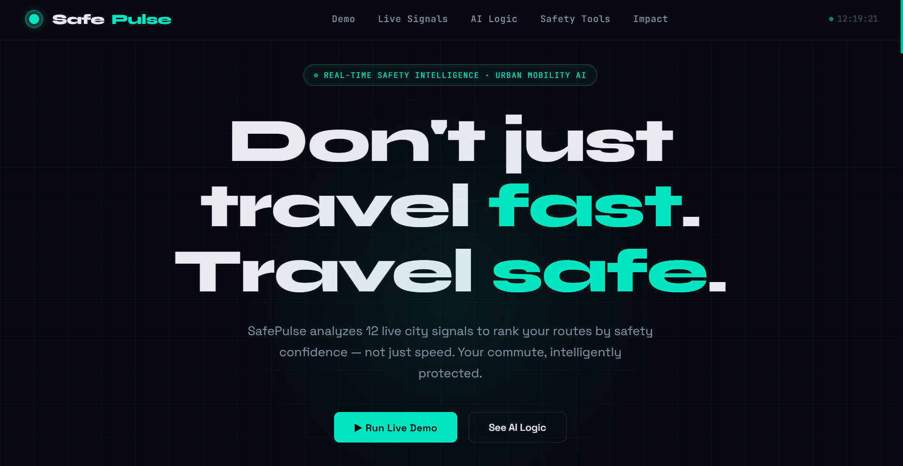
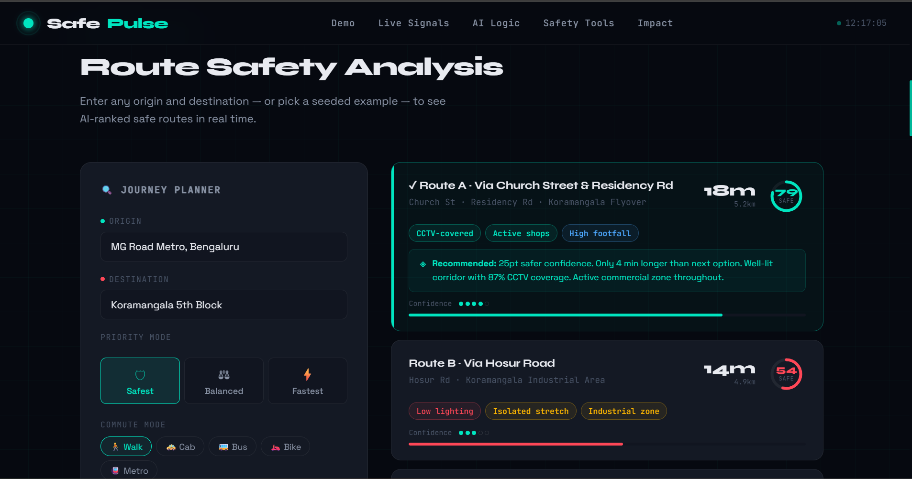
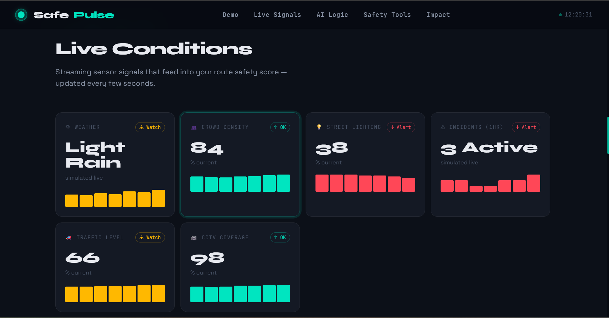
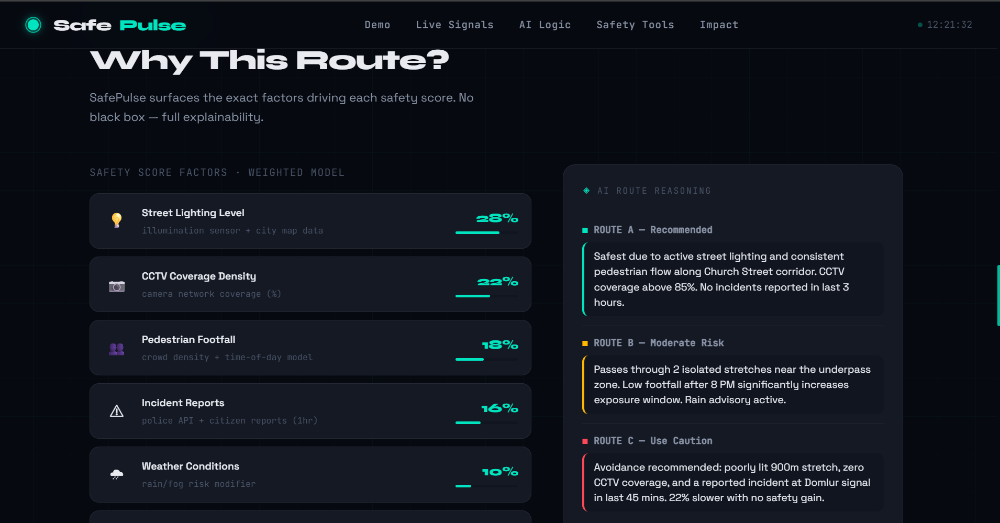

# SafePulse
### AI-Powered Safer Route Intelligence for Urban Commuters

SafePulse helps urban commuters choose the **safest route, not just the fastest one**.  
Instead of relying only on ETA, SafePulse uses real-time or simulated urban signals like crowd density, lighting, incidents, traffic, and weather to generate a **Safety Score** and recommend the most reliable route within seconds.

> **Built for hackathon impact:** clear problem, fast actionable output, realistic logic, and an instantly understandable demo.

---

## Why SafePulse Matters

Urban travel decisions are often made with incomplete information.  
A route may be fast but poorly lit, isolated, recently reported unsafe, or less active at night.

SafePulse addresses one focused problem:

**“How can a commuter quickly decide which route is safest right now?”**

Instead of building a full mobility platform, SafePulse delivers a practical micro-solution:
- Compare route options
- Understand risk instantly
- Get an AI-generated recommendation
- Act within seconds

---

## What Makes It Stand Out

- **Solves one real problem well** instead of trying to solve all of urban mobility
- **Actionable output in seconds** with a clear recommended route
- **Explainable AI logic** through transparent safety scoring
- **Live intelligence feel** using dynamic/simulated real-time signals
- **Hackathon-ready prototype** that is visually polished, feasible, and demo-friendly

---

## Core Features

- **Source → destination route analysis**
- **Three route options with ETA**
- **Safety Score for each route**
- **Risk tags** such as:
  - Low lighting
  - Recent incident
  - Isolated stretch
  - High pedestrian activity
  - Rain impact
  - Congestion shift
- **AI recommendation engine**
- **Live city conditions panel**
- **Explainable “Why this route?” section**
- **Emergency confidence features**
  - Share trip status
  - Safer alternative alert
- **Fast interactive prototype experience**

---

## How It Works

SafePulse simulates urban mobility intelligence by combining multiple signals into a route-level safety evaluation.

### Example factors used in scoring
- Time of day
- Weather
- Crowd density
- Street lighting quality
- Recent reported incidents
- Traffic conditions
- Public activity level
- User preference:
  - Safest
  - Balanced
  - Fastest

### High-level logic
Each route is scored based on weighted safety signals.  
If conditions change, the route ranking changes too.

Example reasoning:
- “This route is 3 minutes longer but significantly safer due to better lighting and active shops.”
- “Avoiding this stretch because footfall drops after 9 PM.”
- “Rain and low visibility reduced the confidence score on Route B.”

---

## Demo Flow

A judge or user can understand the product in under a minute:

1. Enter source and destination
2. Select commuting preference
3. View 3 route options
4. Compare ETA vs Safety Score
5. See live city signals update
6. Read AI recommendation
7. Pick the safest available route

---

## Tech Stack

- **Frontend:** HTML, CSS, JavaScript
- **Backend:** Node.js, Express
- **Prototype Logic:** Simulated real-time route intelligence
- **Architecture:** Lightweight, fast, hackathon-friendly MVP

---

## Project Structure

```bash
Safepulse/
│── node_modules/
│── index.html
│── server.js
│── package.json
│── package-lock.json
│── README.md
```

---

## Run Locally

### 1. Clone the repository
```bash
git clone https://github.com/pavani-n-hash/Safepulse
cd Safepulse
```

### 2. Install dependencies
```bash
npm install
```

### 3. Start the server
```bash
node server.js
```

### 4. Open in browser
```bash
http://localhost:3000
```

---

## Example Use Case

Imagine a commuter returning home at night.

Traditional map apps may recommend the fastest path.  
But SafePulse identifies that this path has:
- low lighting,
- low pedestrian presence,
- and a recent incident flag.

So instead, it recommends another route that is:
- 3 minutes longer,
- better lit,
- more active,
- and meaningfully safer.

This makes SafePulse not just a navigation idea, but a **decision intelligence tool** for safer movement in cities.

---

## Why This Is Feasible

SafePulse is intentionally built as a micro-solution.

It does not require a full smart-city infrastructure to demonstrate value.  
The concept can begin with simulated inputs and later integrate with:
- map APIs
- public transport feeds
- city safety reports
- IoT lighting or traffic signals
- anonymized crowd/activity data

That makes the prototype both **practical for a hackathon** and **credible beyond the event**.

---

## Innovation Edge

Most route tools optimize for **speed**.  
SafePulse optimizes for **commuter confidence and safety awareness**.

That shift changes the product from:
- “Which route is fastest?”
to
- **“Which route is safest for me right now?”**

This human-centered framing is the key innovation.

---

## Impact

SafePulse can help support:
- safer night commutes
- better informed urban travel choices
- improved commuter confidence
- more inclusive mobility for vulnerable users
- smarter real-time route decisions in uncertain environments

Potential beneficiaries:
- students
- office commuters
- women traveling late
- solo travelers
- people unfamiliar with a city
- parents monitoring dependents’ travel

---

## Future Scope

- Real-time API integrations
- Personalized commuter profiles
- Voice-based assistant mode
- Safety heatmap overlays
- Incident-aware adaptive rerouting
- Smartwatch emergency support
- Predictive unsafe zone alerts

---

## Screenshots / Demo

Add these before submission:
- Hero page screenshot : 

- Route comparison screenshot : 

- Live signals screenshot : 

- AI explanation screenshot : 


---

## Hackathon Fit

SafePulse is designed to match hackathon judging expectations:
- **Clear problem statement**
- **Focused MVP**
- **Functional prototype**
- **Explainable technical logic**
- **Strong user impact**
- **High demo clarity**
- **Real-world scalability**

---

## Team

**Team Name:** SafePulse  
**Project:** Smart Mobility Intelligence System  
**Built by:** Pavani


---

## Submission Summary

SafePulse is an AI-powered urban mobility micro-solution that helps commuters make safer route decisions in real time.  
By combining live or simulated city signals into an explainable Safety Score, the system recommends the best route within seconds and turns navigation into a smarter, safer decision-making experience.

---

## License

This project is created for hackathon/demo purposes.
